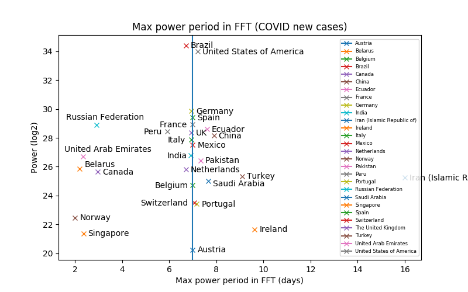

# periodicity in COVID data from WHO

I was wondering if there was any periodicity in new cases repotred by countries, and what that periodicity looked like across the countries reporting cases to the WHO. 

[colab notebook](https://colab.research.google.com/drive/1wVrB2gyQOaJtSJXRw7XAZxbA9pogq4if?usp=sharing)



```python3 who_covid.py WHO-COVID-19-global-data.csv```
